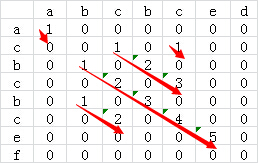

### 美团秋招算法题目

#### 大富翁游戏

##### 题目描述

>大富翁游戏，玩家根据骰子的点数决定走的步数，即骰子点数为1时可以走一步，点数为2时可以走两步，点数为n时可以走n步。求玩家走到第n步（n<=骰子最大点数且是方法的唯一入参）时，总共有多少种投骰子的方法。 

##### 题目分析

> 这道算法题可以用归纳方法来做，其实也就是斐波那契数列的变种问题。
>
> 假设用f(n)表示玩家走到n步时共有f(n)中走法，所以可以推断出
>
> f(1) = 1
>
> f(2) = f(1) + 1 =2
>
> f(3) = f(2) + f(1) + 1 = 4
>
> 则：
>
> f(n) = f(n - 1) + f(n - 2) + f(n - 3) + ... + f(2) + f(1) + 1 = 2 ^ (n - 1)

有了这个思路，就很容易编写出代码了。

##### 代码

```java
import java.util.Scanner;
 
public class Main {
    public static void main(String []args){
        Scanner scanner = new Scanner(System.in);
        int num = scanner.nextInt();
        System.out.print(1 << (num - 1));
    }
}
```

#### 钱币问题

##### 题目描述

>给你六种面额 1、5、10、20、50、100 元的纸币，假设每种币值的数量都足够多，编写程序求组成N元（N为0~10000的非负整数）的不同组合的个数。

##### 题目分析

> 这个问题我们可以求解理解为N - 1, N - 5, N - 10, N - 20, N - 50, N - 100这几种情况的和，对于N元我们又可以理解从1～N这些钱的组合数的和。对于N值为1~4只有1种组合，即f(x) = 1 (1 =<  x <= 4)，对于5~9我们有2中组合，即f(x) = f(x - 5) + 1 (5=<  x <= 9)，一次类推下去，对于N，则f(n) = f(n -1) + f(n - 5) + f(n - 10) + f(n - 20) + f(n - 50) + f(n - 100)，则用数组res记录1～N的组合数可以得到下表。

| 1    | 2    | 3    | 4    | 5    | 6    | 7    | 8    | 9    | 10   |
| ---- | ---- | ---- | ---- | ---- | ---- | ---- | ---- | ---- | ---- |
| 1    | 1    | 1    | 1    | 2    | 2    | 2    | 2    | 2    | 4    |

下面给出代码

##### 代码

```java
import java.util.Scanner;
 
public class Main {
    public static void main(String []args){
        Scanner scanner = new Scanner(System.in);
        int money = scanner.nextInt();
        int coins[] = {1, 5, 10, 20, 50, 100};
        long res[] = new long[money + 1];
        res[0] = 1L;
        for (int i = 0; i < coins.length; i ++) {
            for (int j = 1; j <= money; j ++) {
                //如果j大于当前的最大钱币，就加上N-coins[i]的数量
                if (j >= coins[i]) {
                    res[j] += res[j - coins[i]];
                }
            }
        }
        System.out.print(res[money]);
    }
}
```

#### 矩形游戏

##### 题目描述

> 给定一组非负整数组成的数组h，代表一组柱状图的高度，其中每个柱子的宽度都为1。 在这组柱状图中找到能组成的最大矩形的面积（如图所示）。 入参h为一个整型数组，代表每个柱子的高度，返回面积的值。


##### 题目分析

> 依次选择每一根柱子，求出每一根柱子扩展出去的最大矩形，那么其中最大的矩形就是我们想要的。计算的时候选择柱子，向左向右扩展就可以计算，记录最大值。


##### 代码

```java
import java.util.Scanner;
 
public class Main {
    public static void main(String []args) {
        Scanner scanner = new Scanner(System.in);
        int n = scanner.nextInt();
        int arr[] = new int[n];
        for (int i = 0; i < n; i ++) {
            arr[i] = scanner.nextInt();
        }
 
        int maxArea = 0;
 
        for (int i = 1; i < n; i ++) {
            int temp = arr[i];
            //向左扩展
            for (int left = i-1; left >= 0; left --) {
                if (arr[left] < arr[i]) {
                    break;
                } else {
                    temp += arr[i];
                }
            }
 			//向右扩展
            for (int right = i + 1; right < n; right ++) {
                if (arr[right] < arr[i]) {
                    break;
                } else {
                    temp += arr[i];
                }
            }
 			//记录最大值
            if (maxArea < temp) {
                maxArea = temp;
            }
        }
        //输出最大值
        System.out.print(maxArea);
    }
}
```


#### 最长公共字符串

##### 题目描述

> 给出两个字符串（可能包含空格）,找出其中最长的公共连续子串,输出其长度。

##### 题目分析

> 1、把两个字符串分别以行和列组成一个二维矩阵。
>
> 2、比较二维矩阵中每个点对应行列字符中否相等，相等的话值设置为1，否则设置为0。
>
> 3、通过查找出值为1的最长对角线就能找到最长公共子串。

	

但是其实找矩阵最长的对角线是一件麻烦的事情，因此可以做出如下改版

> 为了进一步优化算法的效率，我们可以再计算某个二维矩阵的值的时候顺便计算出来当前最长的公共子串的长度，即某个二维矩阵元素的值为1加上左上角的值，这样就避免了后续查找对角线长度的操作了。修改后的二维矩阵如下：



##### 代码

```java
import java.util.Scanner;
 
public class Main {
    public static  void main(String []args){
        Scanner scanner = new Scanner(System.in);
        String str1 = scanner.nextLine();
        String str2 = scanner.nextLine();
        int row = str1.length();
        int col = str2.length();
        int dp[][] = new int[row][col];
        int max = 0;
 
        if (str1.length() > 50 || str2.length() > 50) {
            System.out.println("输入的字符串长度超限！");
        }
 
        for (int i = 0; i < row; i ++) {
            for (int j = 0; j < col; j++) {
                if (str1.charAt(i) == str2.charAt(j)) {
                    if (i >=1 && j >= 1) {
                        dp[i][j] = dp[i - 1][j - 1] + 1;
                    } else {
                        dp[i][j] = 1;
                    }
                    max = max > dp[i][j] ? max : dp[i][j];
                } else {
                    dp[i][j] = 0;
                }
            }
        }
        System.out.print(max);
    }
}
```

